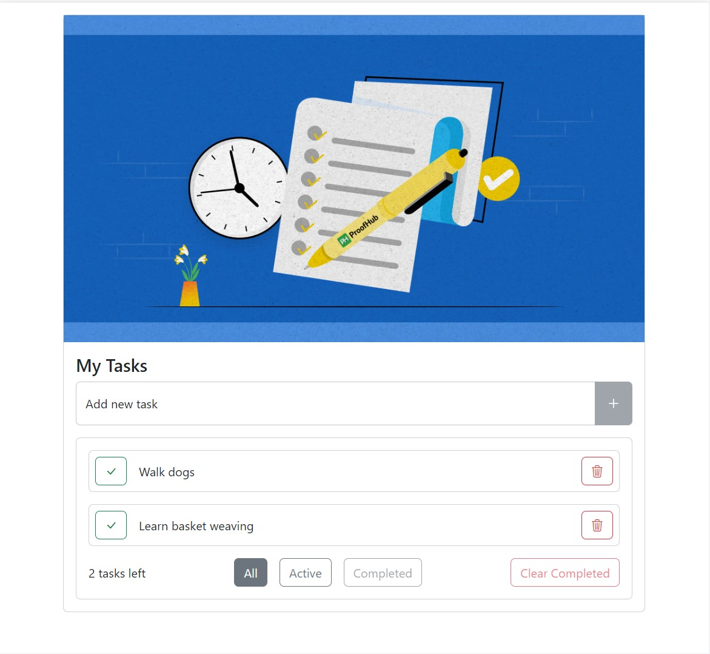

# angular-todo

This project was generated with [Angular CLI](https://github.com/angular/angular-cli) version 16.1.0.

## Development server

Run `npm run start` for a dev server. Navigate to `http://localhost:4400/`. The application will automatically reload if you change any of the source files.

